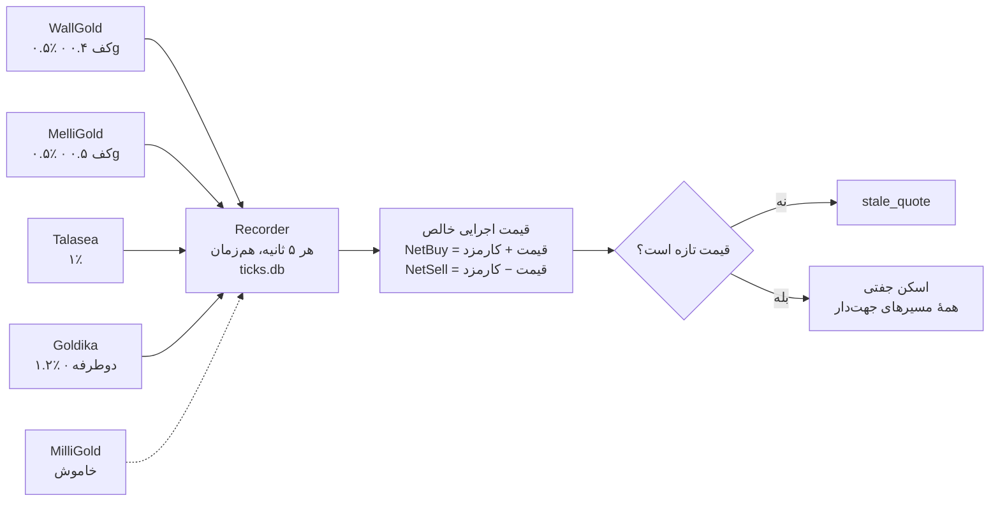
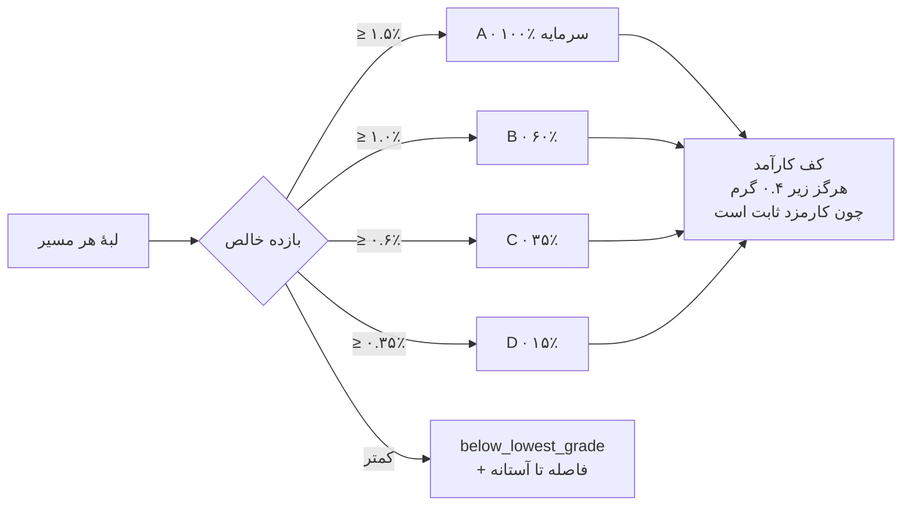
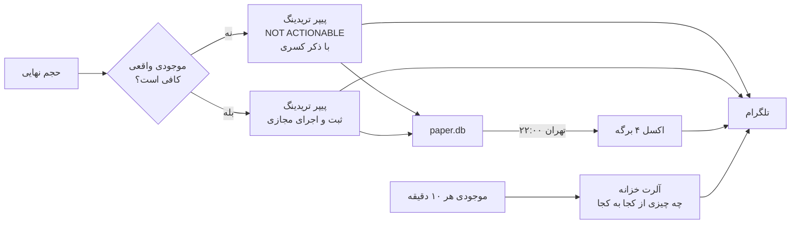
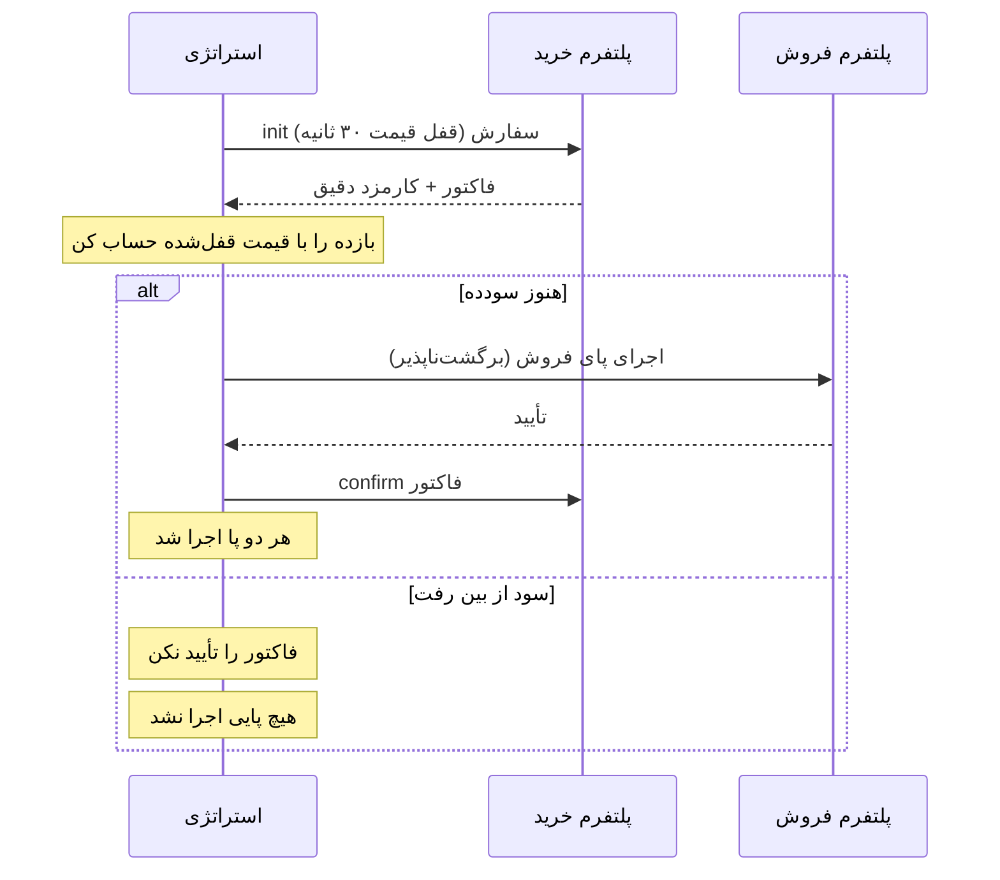

# GoldArbitrage — گزارش تغییرات

از کامیت `421c87d` تا امروز. تاریخ: ۱ سپتامبر ۲۰۲۶.

---

## صفحهٔ ۱ — چه چیزی عوض شد

### پلتفرم‌ها از کد به داده منتقل شدند

پیش از این، هر عدد مخصوص یک پلتفرم داخل پایتون بود. `OpportunityFinder` زنجیره‌ای از
`if platform == "miligold"` داشت و اضافه کردن پلتفرم یعنی ویرایش محاسبهٔ سود.

حالا همه‌چیز در `config/platforms.toml` است: نرخ کارمزد، حداقل وزن مشمول، گام حجم، عمر قیمت،
و قابلیت‌های هر پلتفرم. **هیچ‌جای لایهٔ استراتژی نام پلتفرمی وجود ندارد.**

تفکیک `enabled` از `verified` هم اضافه شد:

| enabled | verified | نتیجه |
|---|---|---|
| ✗ | — | کاملاً غایب |
| ✓ | ✗ | قیمت می‌دهد و در Recorder می‌آید، ولی هرگز سفارش نمی‌گیرد |
| ✓ | ✓ | قابل معامله |

یعنی یک پلتفرم جدید می‌تواند هفته‌ها داده جمع کند بدون اینکه بتواند پول از دست بدهد.

### دو پلتفرم جدید اضافه شد

**ملی‌گلد** — API کامل از باندل‌های `melligold.com/pwa/` استخراج شد. قیمت عمومی است و
لاگین نمی‌خواهد. ورود دومرحله‌ای با کد پیامکی است، ولی `refresh` توکن تازه با پنجرهٔ ۷ روزهٔ
جدید می‌دهد — پس **کد پیامکی فقط یک بار لازم است**.

**طلاسی** (همان طلا۳۰) — `api.talasea.ir/api/market/getGoldPrice` عمومی است. تنها پلتفرمی که
ورود با رمز دارد و اصلاً کد پیامکی نمی‌خواهد.

### واحدها و اعداد اصلاح شدند

| مورد | قبل | بعد |
|---|---|---|
| مقدار طلا | `float` گرم | عدد صحیح میلی‌گرم |
| پول | `float` | `Decimal` |
| زمان | مخلوط naive و aware | همه aware و UTC |
| کارمزد | ضرب ساده | مدل سه‌جزئی |

مدل کارمزد سه جزء دارد که با هم هر زمان‌بندی دیده‌شده را می‌سازند: درصد ساده، درصد با حداقل
وزن مشمول، درصدی که به وزن طلا و با برش به میلی‌گرم گرفته می‌شود، و کارمزد ثابت هر معامله.

### حقایقی که با اندازه‌گیری زنده کشف شد

از این پنج پلتفرم، **فقط گلدیکا واقعاً دوطرفه است.** والگلد، ملی‌گلد، میلی‌گلد و طلاسی همگی یک
قیمت مرجع می‌دهند و اسپردشان کاملاً در کارمزد است. مقایسهٔ قیمت خام بین آنها بی‌معنی است.

کف‌های وزنی که پیدا شدند و اثرشان شدید است. همه از فاکتور یا تاریخچهٔ سفارش واقعی، نه از صفحات
راهنمای پلتفرم‌ها:

| پلتفرم | کف وزن مشمول | فقط سمت | نرخ مؤثر در حداقل |
|---|---:|---|---:|
| والگلد | ۰.۴ گرم | **فروش** | ۲۸.۶٪ در ۷ سوت |
| ملی‌گلد | ۱ سوت | هر دو | ۵.۳٪ در ۱۹ سوت |
| میلی‌گلد | ۱ سوت | هر دو | ۱.۰٪ در ۱۰۰ سوت |

**کف والگلد فقط روی فروش است.** تاریخچهٔ سفارش‌ها این را قطعی می‌کند: سه خرید ۰.۱ گرمی دقیقاً
۰.۵٪ کارمزد دادند، ولی یک فروش ۰.۱ گرمی طوری حساب شد که انگار ۰.۴ گرم بوده، و یک فروش ۰.۰۰۷
گرمی ۲۸.۵۷٪ هزینه داشت. پس این یک «حداقل حجم معامله» نیست، یک ویژگی سمت فروش است — و اشتباه
گرفتنش با حداقل حجم، پای‌های خرید کاملاً سالم را حذف می‌کند.

کف ملی‌گلد هم ۱ سوت است نه ۲.۵ سوت که صفحهٔ کارمزدش می‌گوید. فاکتور ۷۰۷۵۸۷۲ روی ۰.۰۱۹ گرم
دقیقاً ۱ سوت گرفت. همین تفاوت دلیل وجود پرچم `verified` است: مدلی که از اعداد منتشرشده ساخته
شده بود، معاملات کوچک را گران‌تر و بزرگ را ارزان‌تر از واقعیت نشان می‌داد.

کارمزد میلی‌گلد هم از خودش پرسیده شد: به سوت صحیح و رو به پایین گرد می‌شود با کف ۱ سوت، پس در
نیم گرم ۰.۴٪ است نه ۰.۵٪.

عمر قیمت والگلد حدود **۱۳ ثانیه** است، نه ۳۰ که فرض شده بود.

---

## صفحهٔ ۲ — زیرساخت جدید

### Recorder

سرویسی روی VPS ایران که هر ۵ ثانیه از همهٔ پلتفرم‌ها **هم‌زمان** قیمت می‌گیرد و در SQLite
می‌نویسد. هم‌زمانی مهم است: اسپرد بین پلتفرم‌هایی که قیمتشان با چند ثانیه فاصله گرفته شده،
اسپرد نیست، مصنوع است.

هیچ‌کدام از این پلتفرم‌ها تاریخچه نمی‌دهند، پس این تنها راه فهمیدن رفتار بازار بود.

### گزارش لبه

`research/edge_report.py` از روی همان داده می‌گوید هر مسیر چند درصد مواقع بالای آستانه بوده،
در چند اپیزود، و هر اپیزود چقدر دوام آورده.

### پیپر تریدینگ

هر سیگنال ثبت می‌شود، چه قابل اجرا باشد چه نه. دو سؤال جدا جواب داده می‌شود:

- **استراتژی معامله می‌کرد؟** دفتر مجازی این را می‌گوید.
- **ما می‌توانستیم معامله کنیم؟** با موجودی واقعی روی پلتفرم‌ها. سیگنالی که این را رد کند،
  مشکل تأمین سرمایه است نه مشکل بازار.

اگر سیگنالی بیاید و موجودی نداشته باشیم، پیام تلگرام صریحاً `NOT ACTIONABLE` می‌نویسد و
می‌گوید کدام پلتفرم چقدر کم دارد.

### گزارش اکسل شبانه

هر شب ساعت ۲۲ به وقت تهران، یک فایل اکسل چهار برگه‌ای به کانال تلگرام می‌رود: خلاصه، همهٔ
سیگنال‌ها، سیگنال‌های غیرقابل‌اجرا با مجموع سود از دست رفته، و علت رد شدن کاندیداها.

### گرید‌بندی سیگنال

چهار گرید A تا D بر اساس بازده خالص، هر کدام با سهم مشخصی از سرمایه. این «آیا ارزش دارد» را
از «چقدر ارزش دارد» جدا می‌کند، تا سیگنال ضعیف کوچک معامله شود به‌جای اینکه اصلاً نشود.

**کف کارآمد وابسته به مسیر است، نه سراسری.** سیستم برای هر جفت، کف را از پلتفرمی می‌گیرد که
روی آن می‌فروشد:

| مسیر | کف کارآمد |
|---|---|
| هر جا ← والگلد | ۰.۴ گرم |
| هر جا ← ملی‌گلد | ۱ سوت |
| والگلد ← هر جا (سمت خرید) | بدون کف |

پیامدش این است که گرید‌بندی روی مسیرهایی که به **والگلد** می‌فروشند در حجم نیم گرمی بی‌اثر
می‌ماند، چون هر چهار گرید به همان ۰.۴ گرم می‌رسند. ولی روی مسیرهایی که به **ملی‌گلد** می‌فروشند،
گریدهای پایین‌تر واقعاً می‌توانند کوچک‌تر معامله کنند.

### گزارش تلگرام

قبلاً سه پلتفرم را با اسم صدا می‌زد و اگر یکی جواب نمی‌داد کل پیام از بین می‌رفت. حالا هرچه در
اسکن باشد را نشان می‌دهد و قیمت‌ها **all-in** هستند نه خام.

### تست و کیفیت

۴۹ تست pytest، همه سبز. `ruff` تمیز. تست‌های کارمزد به اعداد واقعی قفل شده‌اند — از جمله
فروش واقعی ۰.۵ گرم روی والگلد (سفارش `6055730`) که هزینهٔ مؤثرش دقیقاً ۰.۵۰۰۰٪ درآمد.

---

## صفحهٔ ۳ — یافته‌های تحلیلی

### میلی‌گلد: شکاف دائمی، نه گاه‌به‌گاه

در ۲۷ ساعت و ۱۹,۴۴۰ اسکن، مسیر `miligold → wallgold` در **۱۰۰٪ مواقع** مثبت بود، با میانهٔ
۴۱۶,۸۴۱ تومان بر گرم. یک اپیزود واحد به طول کل بازه.

این آربیتراژ تأخیر نیست، یک شکاف ساختاری است. به همین دلیل میلی‌گلد به تشخیص شما خاموش شد:
نرخی که شبانه‌روز ۲.۵٪ زیر بقیه بماند، بیشتر به یک نرخ مرجع غیرقابل‌اجرا می‌خورد تا قیمت واقعی.

### بدون میلی‌گلد، فعلاً فرصتی نیست

| مسیر | بدترین | میانه | **بهترین لحظه** |
|---|---:|---:|---:|
| melligold → wallgold | ۰.۹۰۹٪- | ۰.۷۴۱٪- | **۰.۳۸۹٪-** |
| wallgold → melligold | ۱.۴۰۶٪- | ۱.۲۴۹٪- | ۰.۹۹۳٪- |
| melligold → talasea | ۱.۵۳۰٪- | ۱.۱۴۳٪- | ۰.۸۳۹٪- |

حتی بهترین لحظهٔ کل بازه منفی بود. دلیلش ساده است: **کف هزینهٔ رفت‌وبرگشت ۱٪ است ولی پراکندگی
قیمت بین پلتفرم‌ها حدود ۰.۳ تا ۰.۵٪.** کارمزد از خود اختلاف قیمت بزرگ‌تر است.

### گلوگاه واقعی: جابه‌جایی موجودی

هر معاملهٔ `i → j` نقد را از `i` و طلا را از `j` کم می‌کند. نقد را می‌شود با انتقال بانکی
برگرداند؛ **طلا را نمی‌شود.** و برگرداندن طلا با معامله حدود ۸۰۰ هزار تومان بر گرم هزینه دارد،
یعنی چهار برابر سودی که ساخته‌اید.

پس سقف واقعی این کسب‌وکار سرعت جابه‌جایی سرمایه است، نه فراوانی فرصت.

### توصیه‌های باز

1. تحویل فیزیکی طلا بین پلتفرم‌ها را بررسی کنید — این تعیین می‌کند کسب‌وکار پایدار است یا محدود.
2. پلتفرم بیشتری اضافه کنید. با ۴ پلتفرم ۱۲ مسیر دارید، با ۶ تا ۳۰ مسیر. طلاین با **کارمزد
   ثابت ۵ هزار تومان** به‌جای درصدی، ساختار هزینه را کاملاً عوض می‌کند.
3. حجم معامله را بزرگ‌تر کنید تا کف‌های وزنی بی‌اثر شوند و گرید‌بندی معنا پیدا کند.
4. اجرای lock-then-verify روی پلتفرم‌های دارای فاکتور، تا حالت «یک پا اجرا شد» حذف شود.

---

## صفحهٔ ۴ — دیاگرام استراتژی

### الف) از قیمت تا سیگنال

### ب) گرید‌بندی و تعیین حجم

### ج) ثبت و اطلاع‌رسانی

### د) مسیر اجرای واقعی، وقتی فعال شود

منطق ترتیب: پایی که **قابل لغو** است آخر تأیید می‌شود. اگر پای برگشت‌ناپذیر شکست بخورد، فاکتور را
تأیید نمی‌کنیم و هیچ پوزیشن بازی نمی‌ماند. این حالت «یک پا اجرا شد و طلا روی دستمان ماند» را
تقریباً حذف می‌کند.
